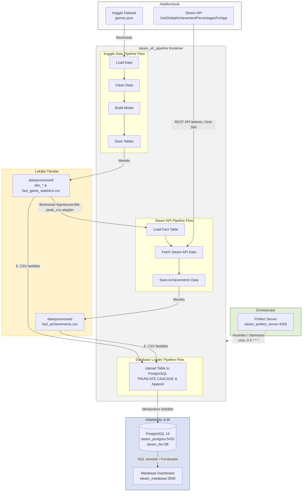

# Steam Data Engineering Pipeline

Ez a projekt egy végponttól végpontig terjedő adatmérnöki folyamatot valósít meg, amely a Steam platform játékaival kapcsolatos adatokat használ, azokat tisztítja, strukturált adattárházba rendezi, majd vizualizálja.

## Futtatás

A futtatáshoz a repository tartalmán kívül a kiinduló adathalmaz (games.json) letöltésére van szükség a [kaggle oldaláról](https://www.kaggle.com/datasets/fronkongames/steam-games-dataset). A letöltött JSON fájlt a repository-n belül a data/raw mappába kell másolni.

A projektet Docker-ből lehet futtatni. Az első indításhoz a következő parancsot kell futtatni a repository gyökeréből:
```PS> docker compose up --build -d```

A konténer felállása után elindul a pipeline, ezt a [prefect webes oldalán](http://localhost:4200/) lehet valós időben követni, az API hívások miatt 5-10 percig is eltelhet a futás.

A pipeline lefutása után megtekinthető [Metabase Dashboardon](http://localhost:3000/) az ETL pipeline eredménye. A Metabase oldalán a ***viewer@steam.mb*** email cím, és ***A7g9^C4)s7*yz1***  jelszó beírásával lehet ezt elérni.

## Architektúra

A rendszer komponensei teljesen konténerizált, izolált Docker környezetben futnak.
Az architektúra felépítése:

